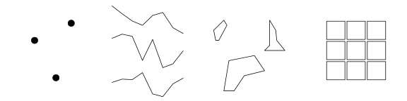
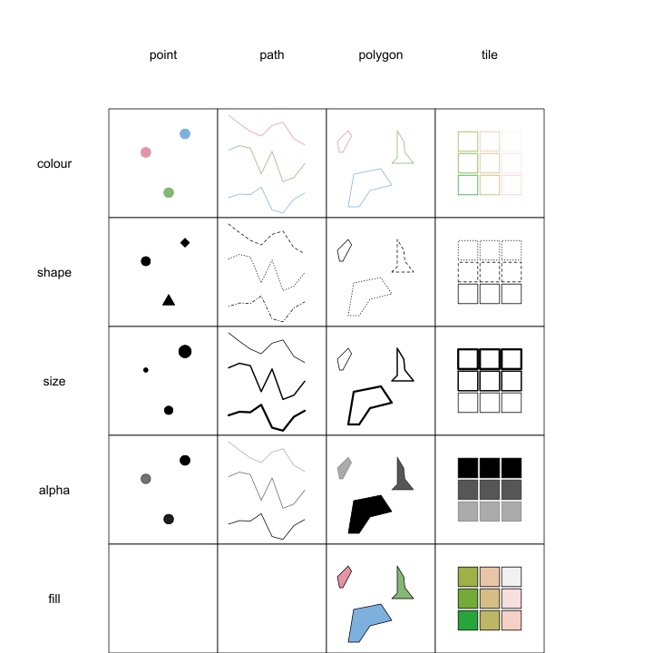

% Automatic Generation of Interactive SVG Maps
% Christoph Molnar
% June 14, 2012

# The `svgmaps` package
* Transform geographical data for plotting
* Uses the [`ggplot2`](http://had.co.nz/ggplot2/) package with an implemented grammar for graphics
* Defines interactive aesthetics for graphical elements
* Present raw data, descriptive statistics or model outcomes in it's geographical context
* Can produce puplishable map graphics for the web


# Example #

* Measure of the signal density in Munich. <br />
* Data set is available in `svgmaps` package. <br />
* Origin: [OpenStreetMap](http://www.openstreetmap.de).


```{r echo = TRUE, eval = TRUE, message=FALSE}
library("svgmaps")
data("signals_grid", package = "svgmaps")

library(sp)
summary(signals_grid)
```

# Geographical objects #
Geographical data can be stored in many different ways. <br />
The following types of objects are the most common (with the equivalent presentation in the [sp](http://cran.r-project.org/web/packages/sp/index.html) package in braces): 

* Points (SpatialPoints)
* Lines (SpatialLines)
* Polygons (SpatialPolygons)
* Grid (SpatialGrid, SpatialPixels) 

# Graphical Objects # 



# Build the graphic # 
```{r simple-plot, fig.align="center", out.width="100%"}
p <- svgmap(signals_grid) + igeom_tile()
print(p)
```
-> Not yet very useful! Properties of the tiles have to be used.

# Aesthetics # 
Aesthetics are properties of graphical elements which can be set to a fixed value (like `colour = "blue"`) or mapped to a variable (like `colour = count`)


# Update Graphic #
Mapping the count of traffic signals to the fill colour of the tiles. 
```{r p-plus-aesthetics}
p <- p + aes(fill = count)
p
```
-> More informative, but can still be enhanced with more details

# Additional layer # 
Adding the signal locations, Munich's border and  the Isar (river in Munich).
```{r layer, tidy=FALSE}
data("signals", package = "svgmaps")
data("muc_border", package = "svgmaps") 
data("isar", package = "svgmaps") 

bb <- slot(signals_grid, "bbox") ## boundary box of the grid

p <- svgmap(signals_grid) + 
  igeom_tile(aes(fill = count), col = "gray8")  + 
  igeom_point(data = signals, colour = "orange", size = 0.3)   +
  igeom_path(data = muc_border, col = "grey29", size = 1) + 
  igeom_path(data = isar, colour = "cyan", size = 0.9, alpha = 0.5) + 
  ## futher options
  scale_fill_gradient(low = "gray8", high = "red") +
  xlim(bb[1, 1], bb[1, 2]) + 
  ylim(bb[2, 1], bb[2, 2]) +
  coord_map() + 
  theme_map()
```
# Additional layer (2) #

```{r show, echo = FALSE, warning = FALSE, out.width = "20cm"}
print(p)
```
# Interactive aesthetics #
In addition to the aesthetics in [`ggplot2`](http://had.co.nz/ggplot2/) the `svgmaps` package defines four interactive aesthetics:

 * Link: An URL which the graphical element is linked to 
 * Tooltip: Displaying a tooltip with additional information, when moving the mouse over the element
 * Highlight: Defines a group of elements which will be highlighted together
 * View: Defines which elements will be displayed together. The view can be changed by clicking. 

 
# Tooltip and Link #
* Tooltip displays the count of traffic signals.
* Tiles are linked to a table with the raw data. 
* The Isar is linked to the corresponding Wikipedia article.
* Interactive aesthetics can be used like non-interactive.
```{r use-inter, eval=FALSE, echo=TRUE, tidy = FALSE}
+ igeom_path(data = isar, colour = "cyan", size = 0.9,  alpha = 0.5, 
             tooltip = "I am the Isar", link = "http://en.wikipedia.org/wiki/Isar")
```
<object data="./figure/tooltip.svg" type="image/svg+xml" width="698px" height="555px"> </object>

```{r tooltip, cache = TRUE, echo = FALSE, warning = FALSE}
## boundary box of the grid
bb <- slot(signals_grid, "bbox")

p <- svgmap(signals_grid) + 
  ## tiles with signal density
  igeom_tile(aes(fill = count, tooltip = count), col = "gray8", link = "../presentation.html#(16)")  + 
  igeom_point(data = signals, colour = "orange", size = 0.3) +
  igeom_path(data = muc_border, col = "grey29", size = 1) + 
  igeom_path(data = isar, colour = "cyan", size = 0.9,  alpha = 0.5, 
             tooltip = "I am the Isar", link = "http://en.wikipedia.org/wiki/Isar") + 
  ## further setting for the plot
  scale_fill_gradient(low = "gray8", high = "red") +
  xlim(bb[1, 1], bb[1, 2]) + 
  ylim(bb[2, 1], bb[2, 2]) +
  coord_map() + 
  theme_map() 
  save_svgmap(p, file = "./figure/tooltip.svg")
```
# View #
The tiles are set to `view = 0` and the additional layers to `view = 1`. The tiles will always be shown and the additional layers can be added and removed by clicking. 
<object data="./figure/traffic-signals.svg" type="image/svg+xml" width="698px" height="555px"> </object>


# Highlighting #

## Arrests in the USA due to assault ##
Highlighting mapped to the id of the element.  <br /> 
-> only the current polygon will be highlighted

<object data="./figure/arrest_map.svg" type="image/svg+xml" width="698px" height="555px"> </object>


# End #
The End

# Appendix #

## Raw data of Munich's traffic signal density.
```{r table, echo = FALSE, results = "asis"}
library(xtable)
table <- as.data.frame(t(as.matrix(signals_grid)))
coords <- table(coordinates(signals_grid))
colnames(table) = names(coords[which(coords == 20)])
rownames(table) = names(coords[which(coords == 37)])
print(xtable(table, digits = 0), type = "html")
```
